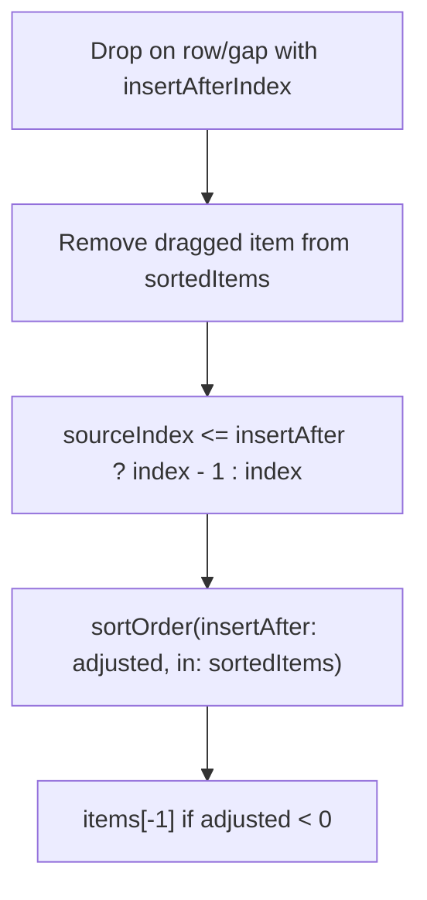
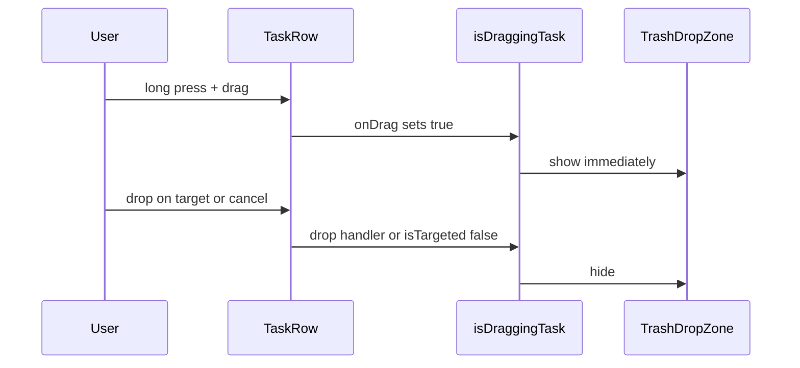

# Drag-drop crash, bottom gap, and trash visibility

## Root cause of the fatal error

The crash at [`TaskListViewModel.swift:98`](EuDo/EuDo/ViewModels/TaskListViewModel.swift) happens when `sortOrder(insertAfter:in:)` receives a **negative** `insertAfter` index.

In [`reorderTask`](EuDo/EuDo/ViewModels/TaskListViewModel.swift), when the dragged item’s `sourceIndex <= insertAfterIndex`, the code decrements the index:

```44:47:EuDo/EuDo/ViewModels/TaskListViewModel.swift
        var adjustedInsertAfter = insertAfterIndex
        if let sourceIndex, let insertAfterIndex, sourceIndex <= insertAfterIndex {
            adjustedInsertAfter = insertAfterIndex - 1
        }
```

Example: drag item at index `0`, drop on its own row or the gap “after” index `0` → `adjustedInsertAfter = -1`. Then:

- `guard index < items.count - 1` passes (`-1 < count - 1`)
- `items[-1]` traps

Drops “outside” the list can still land on a row/gap drop target (SwiftUI hit-testing), so this path is reachable without trash involvement.



## Fix 1: Harden sort-order and reorder indices

**[`TaskListViewModel.swift`](EuDo/EuDo/ViewModels/TaskListViewModel.swift)**

- In `sortOrder(insertAfter:in:)`, treat out-of-range indices explicitly before the midpoint branch:
  - `index < 0` → same as `nil` (insert before first): `items[0].sortOrder - 1`
  - `index >= items.count - 1` → append after last: `items[last].sortOrder + 1`
- In `reorderTask`, after computing `adjustedInsertAfter`, clamp to a safe range for the **post-removal** array (e.g. `nil` for “before first”, or `0...sortedItems.count - 1` for “after index N”) so adjustment can never produce `-1`.

This is a small, defensive change; no Core Data migration.

## Fix 2: Full-height bottom gap for create + drop

**Current behavior:** [`InsertGap`](EuDo/EuDo/Views/InsertGap.swift) is a fixed **30pt** strip between rows. Empty space below the last gap in the `ScrollView` is not tappable.

**Target behavior:** Inter-row gaps stay compact (~30pt). The region **below the last task** fills the rest of the viewport and behaves like “insert after last item” (opens [`TaskEditorSheet`](EuDo/EuDo/Views/TaskEditorSheet.swift) via `presentCreate(after: items.count - 1)`, or `nil` when the list is empty).

**[`TaskListView.swift`](EuDo/EuDo/Views/TaskListView.swift)** — layout approach:

1. Wrap scroll content in a `GeometryReader` (or `background` + `PreferenceKey`) to read viewport height.
2. Apply `.frame(minHeight: viewportHeight, alignment: .top)` on the `LazyVStack` so the stack is at least as tall as the visible scroll area.
3. Keep fixed-height `InsertGap`s between rows.
4. Make the **final** `InsertGap` expand: `.frame(minHeight: 30).frame(maxHeight: .infinity, alignment: .top)` so it consumes all remaining vertical space.
5. Keep the existing `.dropDestination` on that bottom gap so drag-to-end reorder still works.

Optional small tweak to [`InsertGap`](EuDo/EuDo/Views/InsertGap.swift): add an `expands: Bool = false` parameter only if needed to avoid changing middle gaps; otherwise apply expansion modifiers only on the last gap in `TaskListView`.

## Fix 3: Show trash immediately on long-press drag

**Current behavior:** [`isDraggingTask`](EuDo/EuDo/Views/TaskListView.swift) is driven only by the root `.dropDestination` `isTargeted` callback (lines 100–105). That tracks hover over drop destinations, not drag **start**, so the trash icon appears late or only when moving toward a target.

**Target behavior:** Trash appears as soon as the user long-presses and begins dragging any task.

**Approach:** Replace `.draggable` on [`TaskRow`](EuDo/EuDo/Views/TaskRow.swift) with `.onDrag` so the closure runs at drag-session start:

```swift
.onDrag {
    withAnimation(.easeInOut(duration: 0.2)) { isDraggingTask = true }
    return NSItemProvider(object: viewModel.taskURI(for: task) as NSString)
}
```

`String.self` drop destinations remain compatible.

**Reset drag state** when the session ends:

- Change root `isTargeted` to **only clear** on `!targeted` (do not set `isDraggingTask = targeted`, which caused the late/incorrect toggle).
- Set `isDraggingTask = false` after successful reorder/trash drops (in existing drop handlers).
- Optionally set `false` in the root drop action when returning `false` for outside drops.

Trash overlay (`if isDraggingTask { TrashDropZone() ... }`) stays unchanged structurally; only the trigger timing changes.



## Files to touch

| File | Changes |
|------|---------|
| [`TaskListViewModel.swift`](EuDo/EuDo/ViewModels/TaskListViewModel.swift) | Bounds-safe `sortOrder`; safer `reorderTask` index |
| [`TaskListView.swift`](EuDo/EuDo/Views/TaskListView.swift) | Viewport-filling bottom gap; `onDrag` + drag-state reset |
| [`InsertGap.swift`](EuDo/EuDo/Views/InsertGap.swift) | Only if a reusable `expands` flag keeps the view cleaner |

## Manual test plan

1. **Crash regression:** Long-press drag item at top; drop on same row, adjacent gap, and empty area below list — no crash; order unchanged or updated correctly.
2. **Reorder edges:** Single-item list; drag first item to top gap; drag last item to expanded bottom gap — order updates correctly.
3. **Bottom tap:** With 1+ tasks, tap empty space below last row — create sheet opens with insert-after-last semantics.
4. **Trash timing:** Long-press any task — trash appears immediately without moving toward bottom-trailing corner; disappears after drop on row/gap/trash or cancel.
5. **Trash drop:** Drop on trash — task soft-deletes and leaves today’s list.
