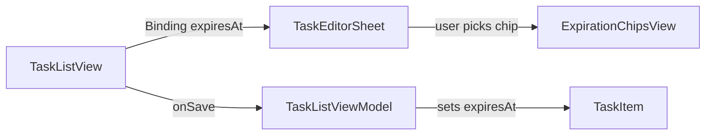

# Expiration Chip Buttons in TaskEditorSheet

## Data flow

The `expiresAt` date needs to travel from the sheet back to the caller. Currently `TaskEditorSheet` only passes back a name. We will add a `@Binding var expiresAt: Date` so the parent (`TaskListView`) owns the state and passes it through to `createTask` / `updateTask`.

## Changes

### 1. New view: `ExpirationChipsView.swift`

A self-contained horizontal chip bar. Receives `@Binding var expiresAt: Date`.

**Chip model:**
- An enum/struct representing each option: `.eod`, `.hours(12)`, `.hours(6)`, `.hours(3)`, `.hours(1)`, `.minutes(30)`, `.minutes(15)`, `.custom(Date)`.
- Computed property filters options: each duration chip only shows if `Date.now + duration < endOfDay`.
- "EOD" is always shown and selected by default.

**Layout:**
- `ScrollView(.horizontal, showsIndicators: false)` containing an `HStack(spacing: 8)`.
- Each chip is a capsule with label text (e.g. "EOD", "12h", "6h", "3h", "1h", "30m", "15m").
- Selected chip gets a filled capsule background; unselected gets a stroked capsule.
- Fixed chip height (e.g. 34pt). Capsule shape, horizontal padding ~12pt.
- Last element: a circle button (same height/width = 34pt) with `plus` icon normally, `xmark` icon when a custom time is active.
- Tapping the circle opens a `DatePicker` (`.hourAndMinuteOnly` / time component) in a popover or inline, constrained from now to 11:59:59 PM.
- When custom is active, a chip showing the remaining duration (e.g. "2h 15m") appears before the circle button. Tapping the xmark circle clears custom and reverts to EOD.

**Chip labels for time-remaining presets:** "12h", "6h", "3h", "1h", "30m", "15m".

### 2. Update `TaskEditorSheet.swift`

- Add `@Binding var expiresAt: Date` parameter.
- Place `ExpirationChipsView(expiresAt: $expiresAt)` pinned to the bottom of the sheet, outside the text editor's scrollable area. Use a `VStack` with the text editor `.frame(maxHeight: .infinity)` and the chips bar at the bottom with fixed padding.

### 3. Update `TaskListView.swift`

- Add `@State private var draftExpiresAt = TaskItem.endOfDay(for: Date())`.
- Pass `expiresAt: $draftExpiresAt` to `TaskEditorSheet`.
- Reset `draftExpiresAt` in `presentCreate` and populate in `presentEdit`.
- In `saveTask`, pass `draftExpiresAt` to the view model.

### 4. Update `TaskListViewModel.swift`

- `createTask` gains an `expiresAt: Date` parameter, sets `newItem.expiresAt = expiresAt`.
- `updateTask` gains an `expiresAt: Date` parameter, sets `task.expiresAt = expiresAt`.

## Key details

- End of day = `TaskItem.endOfDay(for: Date())` (11:59:59 PM today), reuse existing helper.
- Time-remaining chips calculate against `Date()` at render time; they disappear dynamically if their deadline would exceed EOD.
- The custom DatePicker should use `.datePickerStyle(.wheel)` or `.compact` with `displayedComponents: .hourAndMinute`, and range `Date()...eod`.
- When a custom time is picked, `expiresAt` is set to today at that hour/minute. The chip label shows relative time (e.g. "2h 15m" or "45m").

## Files to touch

- **New:** [`EuDo/EuDo/Views/ExpirationChipsView.swift`](EuDo/EuDo/Views/ExpirationChipsView.swift)
- **Edit:** [`EuDo/EuDo/Views/TaskEditorSheet.swift`](EuDo/EuDo/Views/TaskEditorSheet.swift) -- add binding + layout chips at bottom
- **Edit:** [`EuDo/EuDo/Views/TaskListView.swift`](EuDo/EuDo/Views/TaskListView.swift) -- add state + pass binding + wire to save
- **Edit:** [`EuDo/EuDo/ViewModels/TaskListViewModel.swift`](EuDo/EuDo/ViewModels/TaskListViewModel.swift) -- accept expiresAt in create/update
