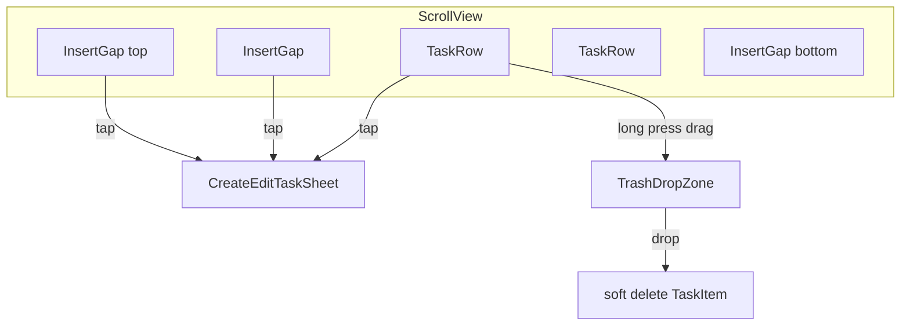

# Spaced Task List Refactor

## Why ScrollView over List

[`ContentView.swift`](EuDo/EuDo/ContentView.swift) currently uses a standard `List` with `NavigationLink`, swipe-delete, and toolbar add/edit controls. Your desired UX conflicts with List’s strengths:

| Requirement | List | ScrollView + custom rows |
|---|---|---|
| Tappable vertical gaps between rows | Awkward (fake rows, separator fighting) | Natural (`InsertGap` views between rows) |
| Long-press drag without Edit mode | `onMove` needs `EditMode` | Custom `.draggable` / drop destinations |
| Bottom trash zone only while dragging | Hard to overlay | Easy with conditional overlay |
| Tap row → edit sheet | Possible | Same |

**Recommendation:** use `ScrollView` + `LazyVStack(spacing: 0)` with interleaved gap and task rows. Keep the existing `@FetchRequest` sort order as the source of truth, backed by a new explicit ordering field.



## 1. Add explicit display order to Core Data

Gap insertion and future drag-and-drop both need a persisted position independent of `createdAt` / `expiresAt`.

**Model change** in [`EuDo.xcdatamodel/contents`](EuDo/EuDo/EuDo.xcdatamodeld/EuDo.xcdatamodel/contents):
- Add `sortOrder: Double` (non-optional, default `0`)

**Swift changes** in [`TaskItem.swift`](EuDo/EuDo/EuDo/TaskItem.swift):
- Add `@NSManaged var sortOrder: Double`
- In `awakeFromInsert()`, set `sortOrder = Date().timeIntervalSince1970` as a safe default for toolbar/legacy creates
- Add helper:

```swift
static func sortOrder(insertAfter index: Int?, in items: [TaskItem]) -> Double
```

Logic: if inserting at top (`index == nil`), return `first.sortOrder - 1`; if after last item, return `last.sortOrder + 1`; otherwise average of neighbors `(before + after) / 2`.

**FetchRequest update** in `ContentView`:
- Primary sort: `sortOrder` ascending
- Keep secondary sorts (`taskState`, `expiresAt`, `createdAt`) as tie-breakers for future date-based grouping

**Preview data** in [`Persistence.swift`](EuDo/EuDo/Persistence.swift): assign incrementing `sortOrder` (0, 1, 2, …) so gaps render predictably.

## 2. Replace List with interleaved gap + task layout

Refactor the body of [`ContentView.swift`](EuDo/EuDo/ContentView.swift) (or extract a small `TaskListView` struct in the same file to keep scope tight):

```swift
ScrollView {
  LazyVStack(spacing: 0) {
    InsertGap(onTap: { presentCreate(after: nil) })

    ForEach(Array(items.enumerated()), id: \.element.id) { index, task in
      TaskRow(task: task, ...)
      InsertGap(onTap: { presentCreate(after: index) })
    }
  }
  .padding(.horizontal)
}
.scrollIndicators(.hidden)
```

**`InsertGap`** (~24–32 pt height):
- `Button` (or `contentShape(Rectangle())` + `onTapGesture`) spanning full width
- Clear/minimal background; optionally a subtle divider or `Color.clear` hit target
- Opens create sheet with `insertAfterIndex` stored in sheet state

**`TaskRow`**:
- Reuse current label content (name + created date caption)
- **Tap** → open edit sheet pre-filled with task name (no `NavigationLink`)
- **Long-press + drag** → reorder and/or drop on trash (see §4)
- No swipe actions

**Remove from toolbar:** `EditButton`, plus-button add (gaps replace it). Keep navigation title `"Today"`.

**NavigationView detail:** remove the placeholder `Text("Select a task")` column; use `.navigationViewStyle(.stack)` so iPhone is a single-column experience.

## 3. Unified create/edit sheet

Add a small sheet view (private struct in `ContentView.swift` is fine for now):

**State:**
```swift
enum TaskSheetMode: Identifiable {
  case create(insertAfterIndex: Int?)
  case edit(TaskItem)
}
@State private var sheetMode: TaskSheetMode?
@State private var draftName = ""
@FocusState private var isNameFocused: Bool
```

**Presentation:**
```swift
.sheet(item: $sheetMode) { mode in
  NavigationStack {
    Form { TextField("Task name", text: $draftName) }
      .navigationTitle(mode.isCreate ? "New Task" : "Edit Task")
      .toolbar { /* Cancel + Save */ }
  }
  .presentationDetents([.large])
  .presentationDragIndicator(.hidden)
  .onAppear { draftName = ...; isNameFocused = true }
}
```

**Save behavior:**
- **Create:** insert `TaskItem`, set `name` from field, compute `sortOrder` via helper, set today’s `expiresAt` / defaults, save context
- **Edit:** update `name` + `lastUpdatedAt`, save context
- **Cancel:** dismiss without save

Replace existing `addItem()` with create-from-sheet logic; remove hard-coded `"New Task"` immediate insert from toolbar.

## 4. Long-press drag, reorder, and trash soft-delete

**Drag activation:**
- Attach `.draggable(task.id.uuidString)` (or stable `objectID` URI string) with a custom `preview` showing the row
- Use `.simultaneousGesture(LongPressGesture(minimumDuration: 0.4))` or equivalent so drag feels like tap-and-hold (fine-tune duration in implementation)

**Reorder:**
- Add `.dropDestination(for: String.self)` on each `TaskRow` and optionally on `InsertGap`s
- On drop: move dragged task by recalculating its `sortOrder` relative to drop target (same helper as gap insert)
- Persist with `viewContext.save()`

**Trash zone:**
- `@State private var isDraggingTask = false`
- Overlay at bottom center, only when `isDraggingTask`:
```swift
.overlay(alignment: .bottom) {
  if isDraggingTask {
    TrashDropZone()
      .dropDestination(for: String.self) { ids, _ in
        softDelete(taskID: ids.first)
        isDraggingTask = false
        return true
      }
      .transition(.move(edge: .bottom).combined(with: .opacity))
  }
}
```
- Reuse existing soft-delete logic from `deleteItems` (set `state = .trashed`, `deletedAt`, `lastUpdatedAt`; no `viewContext.delete`)

**Delete `deleteItems(offsets:)`** and all `.onDelete` usage.

## 5. Edge cases

- **Empty list:** render a single large tappable gap (or empty-state gap + message) that opens create sheet with `insertAfterIndex: nil`
- **Duplicate sortOrder:** secondary fetch sorts prevent visual chaos; gap helper averages neighbors so collisions are rare
- **Sheet keyboard:** `@FocusState` + `.large` detent gives room for the text field; no extra chrome needed for v1
- **Core Data migration:** adding non-optional `sortOrder` with default `0` is lightweight; existing installs get `0` and can be re-saved with staggered values on first fetch if needed (optional one-time migration in `ContentView.onAppear` only if preview/testing shows collisions)

## Files to touch

| File | Change |
|---|---|
| [`EuDo.xcdatamodel/contents`](EuDo/EuDo/EuDo.xcdatamodeld/EuDo.xcdatamodel/contents) | Add `sortOrder` |
| [`TaskItem.swift`](EuDo/EuDo/EuDo/TaskItem.swift) | Property + sort helper + default in `awakeFromInsert` |
| [`ContentView.swift`](EuDo/EuDo/ContentView.swift) | Scroll list, gaps, sheet, drag/trash; remove List/toolbar delete/add |
| [`Persistence.swift`](EuDo/EuDo/Persistence.swift) | Preview `sortOrder` values |

## Verification (manual in Xcode)

1. Build/run — list shows tasks with visible vertical gaps, no scroll indicators
2. Tap gap → large sheet, hidden drag indicator, name field focused; save inserts task at that position
3. Tap task row → same sheet pre-filled; save updates name
4. Long-press drag → trash appears bottom-center; drop soft-deletes (task disappears from Today list)
5. Long-press drag onto another row → order updates and persists after relaunch
6. Empty list → can still create first task via gap tap
